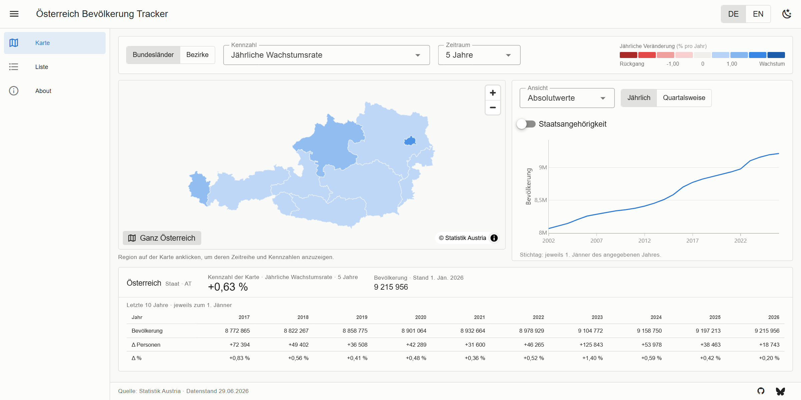

# Austria Population Tracker

An interactive dashboard of Austria's population by region, from 2002 to today. Select a
Bundesland or Bezirk on the map to inspect its time series; the map colouring shows how
fast each region is growing or shrinking.



**Live demo:** [bethadata.github.io/austria-population-tracker](https://bethadata.github.io/austria-population-tracker/)

---

## Features

- **Interactive map** — Bundesländer (9) and politische Bezirke incl. Vienna's 23 Gemeindebezirke (116), click to select, zoom floored at the whole-country view
- **Change-rate colouring** — diverging scale centred on zero, switchable between annualised growth (CAGR), relative and absolute change over a 1 / 5 / 10 / 24-year window
- **Time series** — absolute values, relative change, absolute change and indexed views, with an optional citizenship breakdown; shown beside the map rather than below it, so both fit one screen
- **Region detail** — the map's own indicator as a single headline figure, plus a ten-year table with years across the columns and population, absolute and relative change down the rows
- **Quarterly detail** — at Bundesland level, with a 5-way citizenship split and provisional periods clearly marked
- **Searchable, sortable list** — all 2 256 regions down to municipality level, ranked by fastest growing / shrinking / largest
- **Bilingual** — German and English
- **Static deployment** — runs entirely in the browser, no server and no API keys

---

## Tech Stack

| Category | Library / Tool | Version |
|---|---|---|
| Framework | [Vue 3](https://vuejs.org/) | 3.5 |
| Language | TypeScript | ~5.9 |
| Build tool | [Vite](https://vitejs.dev/) | 8 |
| UI components | [Vuetify](https://vuetifyjs.com/) | 4 |
| Map | [MapLibre GL JS](https://maplibre.org/) | 6 |
| Charts | [Plotly.js](https://plotly.com/javascript/) (basic bundle) | 3.7 |
| State | [Pinia](https://pinia.vuejs.org/) | 4 |
| Routing | Vue Router (hash mode) | 5 |
| i18n | Vue I18n | 11 |
| Data pipeline | Python (standard library only) | 3.10+ |

---

## Getting Started

```bash
npm install
npm run dev            # http://localhost:5173
```

Other scripts:

```bash
npm run build          # type-check + production build
npm run typecheck
npm run data           # refresh data from Statistik Austria
npm run data:validate  # re-run validation on the current data
npm run data:geo       # rebuild boundary geometry (rarely needed)
```


## Data

### Sources

| What | Source | Coverage |
|---|---|---|
| Annual population by region | [Statistik Austria — Bevölkerung zu Jahresbeginn](https://www.statistik.at/statistiken/bevoelkerung-und-soziales/bevoelkerung/bevoelkerungsstand/bevoelkerung-zu-jahres-/-quartalsanfang) | 2002–2026, 2 256 units, 3 citizenship classes |
| Quarterly population | Statistik Austria — Bevölkerung zu Quartalsbeginn | 2010-Q1–2026-Q3, Bundesländer, 5 citizenship classes |
| Boundary geometry | Statistik Austria WFS (`POLBEZ`, `NUTS2`) | current territorial status |
| Cross-validation | [Statistik Austria OGD API](https://data.statistik.gv.at/) | 2002–2026 |

All data is licensed CC BY 4.0 by Statistik Austria.

### Reference dates

Every figure is a **stock measured on one day**, not an average over a period:

| Series | Reference date | A point labelled … |
|---|---|---|
| Annual | 1 January | "2026" means 01.01.2026 |
| Quarterly | first day of the quarter | "Q3 2026" means 01.07.2026 |

The upstream sheets are titled *Bevölkerung zu **Jahres**beginn* and *Bevölkerung zu
**Quartals**beginn*, and the generated JSON carries full ISO dates
(`2026-01-01`, `2026-07-01`), so nothing is inferred from a year label.

This is stated in four places in the UI, because a bare year is easy to misread as
a whole-year figure: a caption under the chart, the exact date on the chart's hover
header, the reference date beside the headline population, and a note on the
ten-year table.

### Region hierarchy

| Level | Count | On the map | In the list |
|---|---|---|---|
| Country | 1 | — | — |
| NUTS 1 | 3 | — | ✓ |
| NUTS 2 (Bundesländer) | 9 | ✓ | ✓ |
| NUTS 3 | 35 | — | ✓ |
| Politische Bezirke | 116 | ✓ | ✓ |
| Gemeinden (LAU 2) | 2 092 | — | ✓ |

### A known upstream inconsistency

The three sheets of the annual workbook are not on a single territorial status. The
`Insgesamt` sheet is back-cast onto current district boundaries, but the two citizenship
sheets keep the pre-2020 assignment for a municipality that moved between **Leibnitz
(610)** and **Südoststeiermark (623)**. The result is that `austrian + foreign` misses
`total` by an identical amount with opposite sign in those two districts for 2002–2019.

`build_data.py` rebuilds the affected district splits from their member Gemeinden, whose
codes already reflect current boundaries. The fix is verified to reproduce the published
values exactly for all other districts in every year, and the corrections are recorded in
`manifest.json`. Totals are never modified — they are confirmed correct against the OGD API.

---

## Project Structure

```
austria-population-tracker/
├── pipeline/
│   ├── ods.py             minimal OpenDocument reader (stdlib)
│   ├── sources.py         upstream URL discovery + caching
│   ├── regions.py         region codes, hierarchy, English names
│   ├── build_data.py      .ods -> JSON artifacts
│   ├── build_geo.py       WFS -> simplified GeoJSON (run manually)
│   ├── validate.py        structural + cross-source checks
│   └── update.py          single entry point
├── public/data/           generated artifacts (committed)
│   ├── manifest.json      vintage, coverage, provenance, corrections
│   ├── regions.json       all 2 256 regions
│   ├── annual/*.json      series per level
│   ├── quarterly.json     Bundesländer, 5 classes
│   └── geo/*.geojson      simplified boundaries
├── src/
│   ├── views/             MapView · ListView · AboutView
│   ├── components/        RegionMap · PopulationChart · MapLegend · RegionDetail · AppFooter
│   ├── stores/            population.ts (shared view state)
│   ├── composables/       useTheme · useMetricLabel
│   ├── utils/             palette · metrics · format · links
│   └── locales/           de.json · en.json
├── tools/                 smoke.mjs · mobile-check.mjs · inspect.mjs
└── .github/workflows/     deploy.yml · update-data.yml
```

---


## Related projects

Two sibling dashboards, same stack and same conventions:

- [Austria Transition Tracker](https://bethadata.github.io/austria-transition-tracker-v2/) — energy transition and emissions
- [Austria Power Simulator](https://bethadata.github.io/austria-power-sim/) — hourly electricity balance

## Licence

Source code: MIT. Data: CC BY 4.0, © Statistik Austria.
